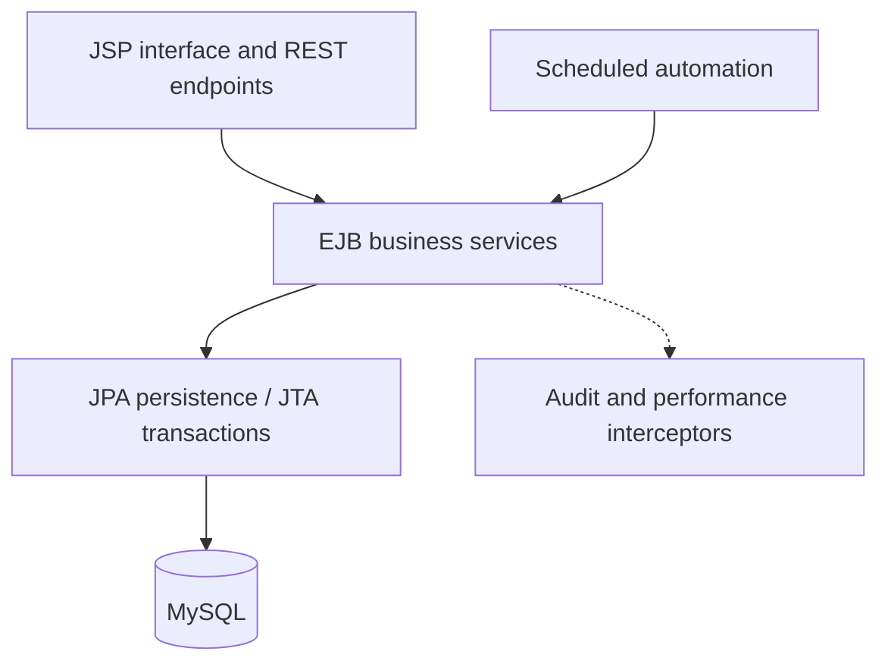

<div align="center">

# 🌐 GlobalTrade SCM

### Supply Chain Management with Jakarta EE

An academic enterprise application for managing inventory, shipments, vendors and customs workflows.


[Features](#-features) · [Architecture](#-architecture) · [Getting Started](#-getting-started) · [Testing](#-testing)

</div>

---

## 📖 Overview

GlobalTrade SCM brings supply-chain operations into a single web application. It connects warehouse inventory, vendor records, shipment tracking and customs processing, with role-based access, scheduled checks and an activity trail.

The project explores enterprise Java concepts through a multi-module application: EJB business services, JPA persistence, JTA transactions, Jakarta Security, interceptors, timers and REST endpoints.

## ✨ Features

| Area | Capabilities |
| --- | --- |
| Dashboard | Overview of supply-chain activity and operational information |
| Inventory | Inventory records, stock receipts, low-stock checks and replenishment recommendations |
| Shipments | Shipment creation, status changes, cancellation rules and route-risk recommendations |
| Vendors | Partner records, validation, evaluations and status management |
| Customs | Customs documents and submission, approval and rejection workflows |
| Automation | Scheduled operational checks, alerts and automation-run records |
| Activity trail | Interceptor-based auditing of supported operations |
| Monitoring | Performance metrics and operational monitoring pages |
| Access control | Database-backed authentication, password hashing and application roles |

Carrier integration is demonstrated through project services, with rule-based recommendations for route risk.

## 🛠️ Technology Stack

<div align="center">

**Java 17 · Jakarta EE 10 · EJB · JPA / JTA · Jakarta Security**

**JAX-RS · CDI · JSP · JavaScript · MySQL 8 · Payara 6 · Maven · JUnit 5**

</div>

## 🏗️ Architecture

The web layer delegates business operations to EJB services. Services apply validation, authorization and transaction rules, and persist data through JPA. Interceptors and timers support auditing, monitoring and scheduled work.



| Module / folder | Responsibility |
| --- | --- |
| `globaltrade-api/` | Shared facade contracts and business fault model |
| `globaltrade-ejb/` | Entities, business services, transactions, interceptors and timers |
| `globaltrade-web/` | JSP pages, REST resources, authentication and web filters |
| `globaltrade-ear/` | EAR packaging and application datasource configuration |
| `database/` | MySQL schema and sample data |
| `docs/` | Deployment instructions and testing guide |

## 🚀 Getting Started

### 1. Prerequisites

- JDK **17**
- Maven **3.9+**
- Payara Server **6**
- MySQL **8**
- IntelliJ IDEA or another Java IDE, if preferred

### 2. Prepare the database

Start MySQL and inspect `database/globaltrade_mysql.sql` before importing it into a dedicated local environment.

> The SQL script resets tables and includes sample data. Do not execute it against a database containing data you need to keep.

The supplied configuration uses database **`globaltrade_scm`** on port **`3306`**.

Update the local datasource in:

```text
globaltrade-ear/src/main/application/META-INF/glassfish-resources.xml
```

Use your own local database credentials. Keep real passwords out of commits and use a dedicated database user for deployment. See the [deployment guide](docs/DEPLOYMENT_GUIDE.md) for configuration details.

### 3. Build

Open a terminal in the project root, alongside `pom.xml`:

```sh
mvn clean package
```

The deployable artifact is:

```text
globaltrade-ear/target/globaltrade-scm.ear
```

### 4. Deploy

Start your Payara 6 domain. Deploy the EAR using IntelliJ IDEA, the Payara admin console, or the following command when `asadmin` is available on your PATH:

```sh
asadmin deploy globaltrade-ear/target/globaltrade-scm.ear
```

Open [http://localhost:8080/globaltrade/](http://localhost:8080/globaltrade/).

## 🧪 Testing

Run the unit tests:

```sh
mvn clean test
```

The JUnit 5 suite covers selected business policies, password hashing, exception behavior and configuration. Payara integration testing and manual workflow validation are described in the [testing guide](docs/TESTING_AND_VALIDATION.md).

## 📚 Documentation

- [Deployment Guide](docs/DEPLOYMENT_GUIDE.md) — database configuration, build and server deployment.
- [Testing and Validation](docs/TESTING_AND_VALIDATION.md) — unit tests, optional integration tests and workflow checks.

## 👤 Maintainer

**Vihanga Thathsara** · Software Engineering Undergraduate

[GitHub](https://github.com/VihangaThathsara) · [LinkedIn](https://www.linkedin.com/in/vihanga-thathsara-00187543b/)
